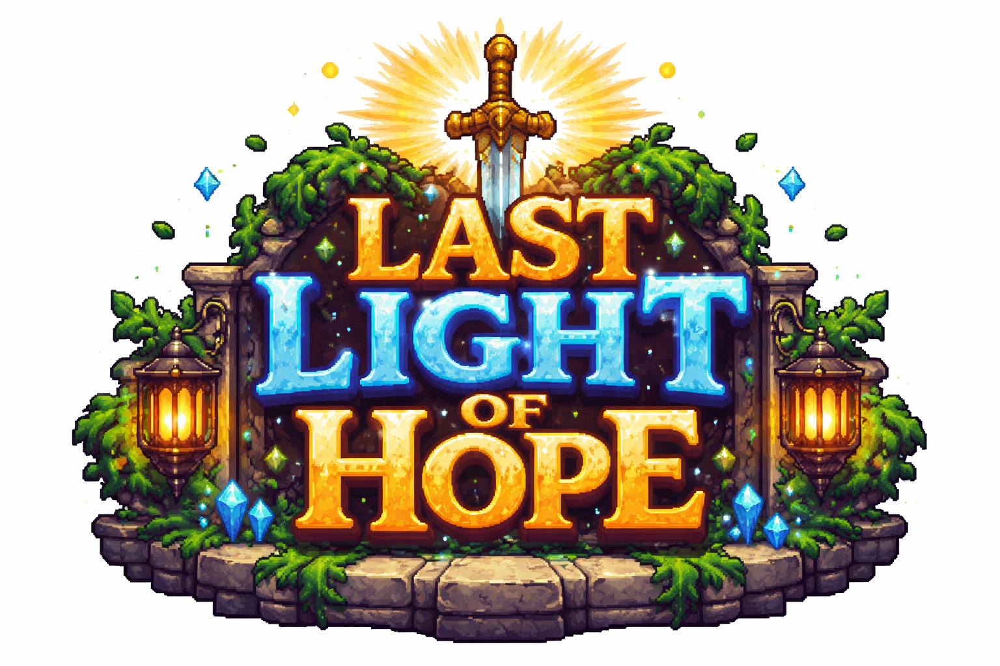
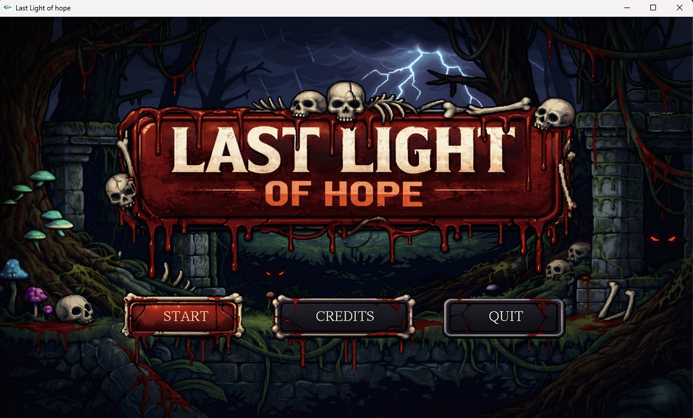
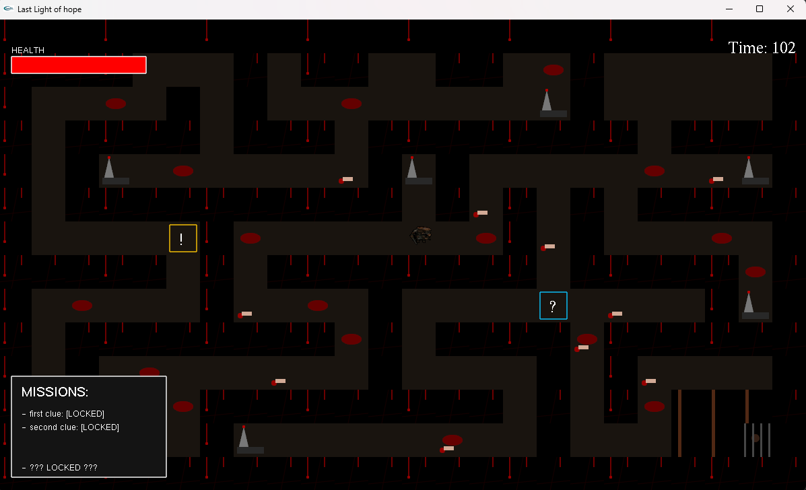
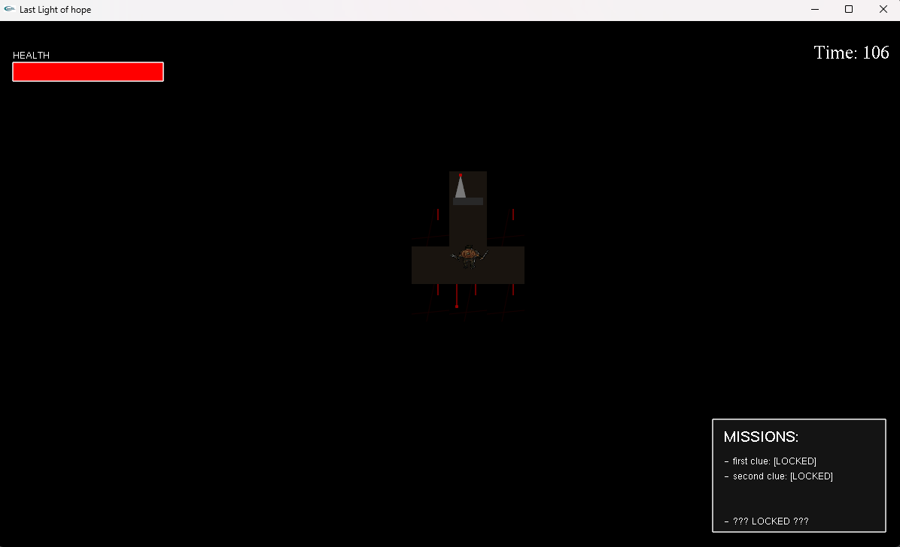
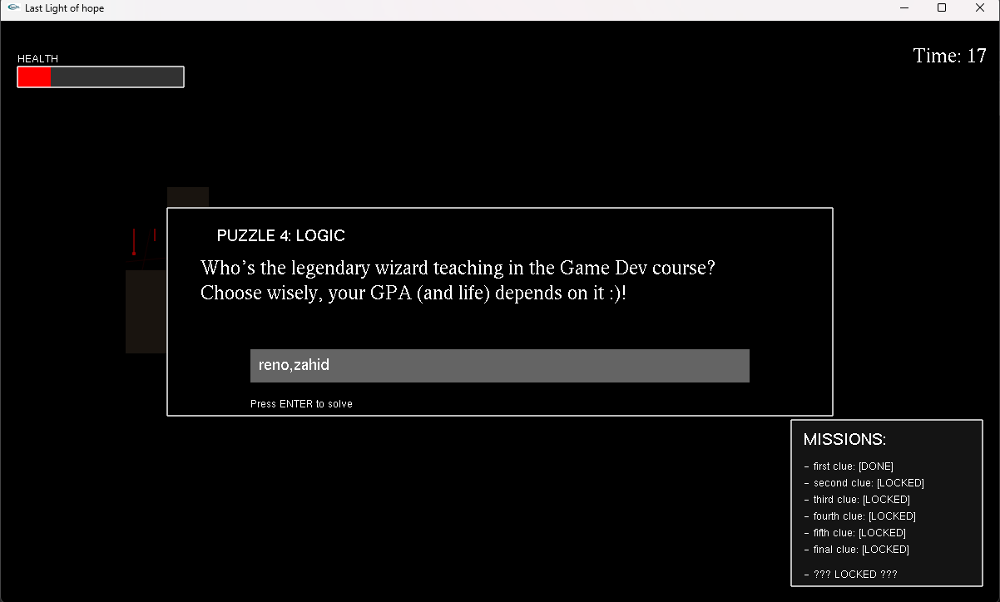
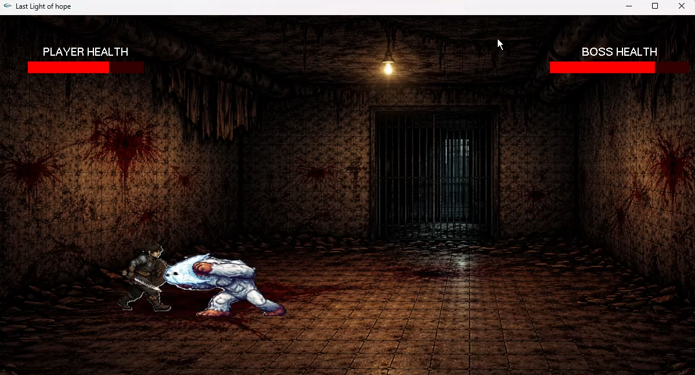
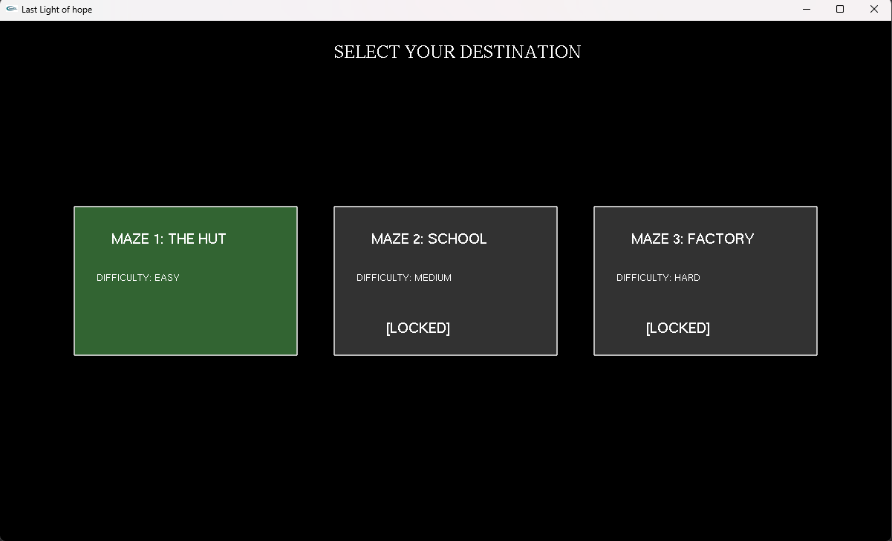

<div align="center">

#  Last Light of Hope
 

### *A Horror Maze Survival Game built with iGraphics (OpenGL/GLUT)*

[](https://isocpp.org/)
[](https://www.opengl.org/)
[](https://www.microsoft.com/windows)

> *"Navigate the darkness, solve the riddles, survive the nightmare."*

</div>

---

## 🎮 About the Game

**Last Light of Hope** is a single-player, top-down **horror survival maze game** developed in **C++** using the **iGraphics library** (built on OpenGL/GLUT). The player navigates through three progressively harder horror-themed mazes — a haunted Hut, an abandoned School, and a derelict Factory — solving cryptic puzzles to unlock a boss encounter.

To survive, the player must:
- 🔦 Navigate dimly lit corridors with a **limited light radius**
- 🧩 Solve all **riddles, anagrams, cipher, logic, and sequence puzzles** in each level
- ⚔️ Defeat a menacing **boss monster** in a real-time side-scrolling fight sequence
- ❤️ Stay alive — health lost from traps and wrong puzzle answers never fully recovers between levels

---

## 📸 Screenshots

| Main Menu | Maze with Light Radius | Without Light (Darkness) |
|:---------:|:---------------------:|:------------------------:|
|  |  |  |

| Puzzle Overlay | Monster Fight Scene | Level Select Screen |
|:--------------:|:-------------------:|:-------------------:|
|  |  |  |

---

## ✨ Game Features

| Feature | Description |
|---------|-------------|
| 🗺️ **3 Unique Maze Levels** | Hand-crafted 14×24 tile-based mazes with increasing complexity |
| 🔦 **Dynamic Darkness System** | Only tiles within a **90-pixel light radius** are visible |
| 🧩 **12 Unique Puzzles** | Riddles, anagrams, logic, cipher, sequence puzzles — 2 to 6 per level |
| ⚔️ **Real-Time Boss Fights** | Side-scrolling combat with animated boss monsters |
| 💀 **Trap Tiles** | Hidden spike traps reset the player to the start |
| ❤️ **Persistent Health** | Health carries over between levels — no full recovery |
| ⏳ **120-Second Timer** | Each level and fight has a 2-minute countdown |
| 🏆 **Progressive Unlocking** | Complete a level to unlock the next one |
| ⏸️ **Pause Menu** | Press `ESC` to pause — animated scale-in pause overlay |
| 🎵 **Reactive Soundtrack** | Different tracks for menu, maze, fight, and heartbeat |
| 📖 **Story Cutscene** | 10-frame cinematic story sequence after Level 1 |
| 🎨 **Animated Sprites** | 5-frame walk animations for player (4 directions) and all 3 bosses |
| 🏅 **Attack Power Upgrades** | Win fights to permanently increase your attack damage |
| 🎉 **Victory Screen** | Gold-bordered win popup with character save reveal |

---

## 🎮 Controls

### Maze Navigation

| Key | Action |
|-----|--------|
| `W` / `↑` | Move Up |
| `S` / `↓` | Move Down |
| `A` / `←` | Move Left |
| `D` / `→` | Move Right |
| `ESC` | Pause / Unpause game |

### Boss Fight

| Key | Action |
|-----|--------|
| `A` | Move Left |
| `D` | Move Right |
| `F` | Attack Boss |
| `ESC` | Pause / Unpause |

### Puzzle Input

| Key | Action |
|-----|--------|
| Any letter/number key | Type answer |
| `BACKSPACE` | Delete last character |
| `ENTER` | Submit answer |

### Other

| Key | Action |
|-----|--------|
| `END` | Force quit game |
| Mouse `Left Click` | Navigate menus, skip story, click victory screen |

---

## 📊 Player Stats & Mechanics

### Starting Stats

| Stat | Value |
|------|-------|
| **Initial Health (HP)** | 100 |
| **Player Speed** | 2 pixels per frame step |
| **Starting Attack Power** | 15 damage per hit |
| **Light Radius** | 90 pixels around player |
| **Level Timer** | 120 seconds |
| **Player Size** | 55×35 pixels |

### Movement System

- Movement is processed at a **20ms fixed update interval** (50 fps logic tick)
- The player moves **2 pixels per step** (`playerSpeed = 2`)
- Diagonal movement is supported (simultaneous `W`+`A`, `W`+`D`, etc.)
- Walking animation cycles through **5 frames** every **5 ticks**
- The system uses **collision padding** (`paddingX=12`, `paddingY=5`) to allow smooth wall-hugging

### Animation

The player has **4 directional sprites**, each with **5 walk frames**:

| Direction | Sprite Files |
|-----------|-------------|
| Front (Down) | `playerTopFront1.bmp` → `playerTopFront5.bmp` |
| Back (Up) | `playerTopBack1.bmp` → `playerTopBack5.bmp` |
| Left | `playerTopLeft1.bmp` → `playerTopLeft5.bmp` |
| Right | `playerTopRight1.bmp` → `playerTopRight5.bmp` |

### Health System

- **Wrong puzzle answer** → `-5 HP`
- **Trap tile touched** → Player teleported back to start (no HP loss from trap itself)
- **Finishing a level** (touching exit tile) → `+10 HP` (capped at 100)
- **Health carries over** between levels — there is no full heal between mazes
- **Health loss in fight** is tracked with a smooth animated health bar
- **Death condition:** `playerHealth <= 0` triggers Game Over screen

### Attack Power Progression

| Event | Attack Power Change |
|-------|-------------------|
| Game Start | **15 damage** |
| Defeat Level 2 Boss | **+5 damage** → **20 damage** |
| Defeat Level 3 Boss | **+5 damage** → **25 damage** |
| New Game | Reset to **15 damage** |

---

## 🗺️ Game Levels

### Level 1 — The Hut *(Easy)*

> *A forsaken wooden hut on the outskirts of a dying town. Shadows breathe here.*

- **Maze Size:** 14 rows × 24 columns (50×50 tile grid)
- **Puzzles Required:** 2 (must solve both to access the boss door)
- **Tile Legend:**
  - `1` = Wall | `0` = Floor | `3` = Trap | `4` = Exit
  - `5` = Boss Door | `6` = Puzzle 1 Trigger | `7` = Puzzle 2 Trigger

| Element | Detail |
|---------|--------|
| Starting Position | (60, 60) — tile (1, 1) |
| Exit Gate | Column 22, Row 1 |
| Boss Gate | Column 18, Row 1 |
| Traps | Multiple `3`-tiles throughout the corridors |
| Puzzle 1 Location | Column 16, Row 5 |
| Puzzle 2 Location | Column 5, Row 7 |

**Level 1 Maze Layout Preview (tile values):**
```
1 1 1 1 1 1 1 1 1 1 1 1 1 1 1 1 1 1 1 1 1 1 1 1
1 0 0 0 0 0 1 T 0 0 0 0 0 0 0 0 1 0 B 0 X X E 1
1 0 # # # 0 1 1 1 1 1 1 1 1 1 0 1 0 1 0 X X X 1
1 0 1 0 0 0 0 0 0 0 0 1 0 0 0 0 1 0 1 0 0 0 0 1
...
```
*(Where: `T`=Trap, `B`=Boss Door, `E`=Exit, `P1`/`P2`=Puzzle Triggers)*

---

### Level 2 — The School *(Medium)*

> *An abandoned school where the lessons never ended — and neither did the screaming.*

- **Puzzles Required:** 4 (must solve all 4 to access the boss door)
- **Boss HP:** 120 (vs. 100 in Level 1)
- **Boss Speed:** 2 px/frame (vs. 1 in Level 1)
- **Boss Damage:** 10 per hit (vs. 8 in Level 1)

| Puzzle # | Tile Code | Location |
|----------|-----------|----------|
| Puzzle 1 | `6` | Column 16, Row 5 |
| Puzzle 2 | `7` | Column 5, Row 7 |
| Puzzle 3 | `8` | Column 21, Row 11 |
| Puzzle 4 | `9` | Column 13, Row 6 |

**Special:** Solving **Puzzle 4** in Level 2 grants `+40 HP` (capped at 100).

---

### Level 3 — The Factory *(Hard)*

> *Rusted gears, broken machines, and something ancient that never sleeps.*

- **Puzzles Required:** 6 (must solve all 6 to unlock the boss door)
- **Boss HP:** 150 (highest)
- **Boss Speed:** 3 px/frame (fastest)
- **Boss Damage:** 12 per hit (highest)
- **Monster Attack Cooldown:** 15 ticks (attacks nearly twice as fast as Level 1/2)

| Puzzle # | Tile Code | Location |
|----------|-----------|----------|
| Puzzle 1 | `6` | Column 1, Row 3 |
| Puzzle 2 | `7` | Column 16, Row 5 |
| Puzzle 3 | `8` | Column 11, Row 1 |
| Puzzle 4 | `9` | Column 5, Row 7 |
| Puzzle 5 | `10` | Column 5, Row 12 |
| Puzzle 6 | `11` | Column 21, Row 11 |

**Special:** Solving **Puzzle 4** in Level 3 restores HP to **full 100** and grants `+70 HP` bonus display.

---

## 🧩 Puzzle System

When the player steps on an active puzzle tile, a text overlay appears at the center of the screen. The player types their answer and presses `ENTER` to submit.

### ✅ Correct Answer → Puzzle tile is removed (becomes floor), mission marked `[DONE]`
### ❌ Wrong Answer → Input is cleared, **player loses -5 HP**

---

### All 12 Puzzles — Full Detail

#### 🔵 Level 1 Puzzles (2 total)

| # | Type | Tile | Riddle / Question | Answer |
|---|------|------|-------------------|--------|
| P1 | Riddle | `?` (cyan) | *"I follow you in the light, but hide when it's dark."* | `SHADOW` |
| P2 | Anagram | `!` (yellow) | *"Unscramble: ETH ILTGH"* | `THE LIGHT` |

#### 🟠 Level 2 Puzzles (4 total)

| # | Type | Tile | Riddle / Question | Answer | Reward |
|---|------|------|-------------------|--------|--------|
| P1 | Riddle | `?` (cyan) | *"What word is always spelled 'wrong'?"* | `WRONG` | — |
| P2 | Logic | `!` (yellow) | *"I am the line between earth and sky."* | `HORIZON` | — |
| P3 | Cipher | `*` (orange) | *"Reverse: SYAWLA"* | `ALWAYS` | — |
| P4 | Logic | `#` (purple) | *"If 1=5, 2=25, 3=125, then 5 = ?"* | `1` | **+40 HP** |

#### 🔴 Level 3 Puzzles (6 total)

| # | Type | Tile | Riddle / Question | Answer | Reward |
|---|------|------|-------------------|--------|--------|
| P1 | Riddle | `?` (cyan) | *"I have cities, but no houses; forests, but no trees; water, but no fish. What am I?"* | `MAP` | — |
| P2 | Math | `!` (yellow) | *"(5 × 5) − (9 × 2) = ?"* | `7` | — |
| P3 | Cipher | `*` (orange) | *"Voltage check: IX + X = ?"* | `19` | — |
| P4 | Logic | `#` (purple) | *"Who's the legendary wizard teaching in the Game Dev course?"* | `reno` / `zahid` / `reno,zahid` | **Full HP restore (+70 display)** |
| P5 | Sequence | `$` (green) | *"2, 4, 8, 16, ?"* | `32` | — |
| P6 | Riddle | `@` (pink) | *"Has a head and a tail, but no body?"* | `COIN` | — |

---

## ⚔️ Boss Fight System

After solving all puzzles in a level, the **Boss Door** (tile `5`) becomes walkable. Stepping on it triggers either a **cinematic story sequence** (Level 1) or an **immediate fight** (Levels 2 & 3).

### Fight Mechanics

| Parameter | Level 1 | Level 2 | Level 3 |
|-----------|---------|---------|---------|
| **Boss HP** | 100 | 120 | 150 |
| **Boss Move Speed** | 1 px/frame | 2 px/frame | 3 px/frame |
| **Boss Damage per Hit** | 8 | 10 | 12 |
| **Boss Attack Cooldown** | 30 ticks | 30 ticks | 15 ticks |
| **Boss Anim Speed** | Every 6 frames | Every 4 frames | Every 3 frames |
| **Character Saved** | LAMIS | HAGGESH | *(Final Boss)* |

### Player Fight Controls

| Action | Key | Detail |
|--------|-----|--------|
| Move Left | `A` | Velocity-based: acceleration +1, friction ×0.75 per frame |
| Move Right | `D` | Max speed ±4.5 px/frame |
| Attack | `F` | 15-tick cooldown; must be within **250px** of boss |
| Start Position | — | Player starts at X=157, Boss starts at X=765 |

### Player Fight Physics (Velocity-Based Movement)

```
Every frame:
  if (D pressed) → velX += 1.0
  if (A pressed) → velX -= 1.0
  velX *= 0.75   (friction / deceleration)
  velX capped at ±4.5 px/frame
  playerX += velX

Boundary limits:
  Left wall:  playerX >= 50
  Right wall: playerX <= screen_width - 160  (1040)
```

### Boss AI Behavior

```
if (distance to player > 80px):
    → State: WALKING — moves toward player at bossSpeed px/frame
    → Walk animation: 5 frames (monster{N}move{1-5}.bmp)

if (distance to player <= 80px):
    → State: ATTACKING — stops moving, plays attack animation
    → Attack animation: 3 frames (monster{N}fight{1-3}.bmp)
    → Deals bossDamage when attack frame == 2
```

### Boss Distance Alert System

| Distance | Sound |
|----------|-------|
| > 150px | `monsterRun.wav` (looping) |
| ≤ 150px | `fightBg.wav` (returns to ambient) |

### Critical Health Alert

When `playerHealth ≤ 30` and `> 0`:
- Game switches to **`heartBeat.wav`** loop (panic sound)
- Returns to fight background music when player heals above 30

### Victory Sequence

After the boss reaches **0 HP**:
- **Levels 1 & 2:** Gold-bordered popup floats up with *"YOU SAVED [CHARACTER]!"* message, a pulsing *"Click to Continue"* prompt.
- **Level 2 only:** Shows `"ATTACK POWER INCREASED +5!"` in spring green.
- **Level 3 (Final):** Full black-screen finale with `"GAME COMPLETED"` in gold, a *"Thanks for playing!"* subtitle, and a pulsing **START NEW GAME** button.

### Damage Flash

When the player is hit, the entire screen flashes **red** for 10 frames (`damageFlashTimer = 10`, flashes every other frame).

---

## 🎵 Sound System

The game uses **Windows PlaySound API** for all audio — context-sensitive and non-blocking.

| Sound File | Trigger | Type |
|------------|---------|------|
| `mazeBg.wav` | Main menu, credits, or idle in menu | Looping |
| `mazeCreepy.wav` | Player standing still in maze | Looping |
| `walk.wav` | Player moving in maze | Looping |
| `storyBg.wav` | Story cutscene (Level 1 intro) | Looping |
| `fightBg.wav` | Boss fight ambient | Looping |
| `monsterRun.wav` | Boss > 150px away during fight | Looping |
| `monsterAttack.wav` | Boss attacks player | One-shot |
| `heartBeat.wav` | Player HP ≤ 30 | Looping |
| `gameOver.wav` | Player dies or timer runs out | One-shot |

All sounds are mutually exclusive — switching context stops the previous track before starting the new one.

---

## 🗂️ Project Structure

```
Last Light of Hope/
│
├── Last Light of Hope/          # Main source project
│   ├── iMain.cpp                # Entry point, iGraphics callbacks (iDraw, iMouse, iKeyboard)
│   ├── Common.h                 # Global constants (screen size, tile size, enums)
│   ├── Variables.h              # All extern variable declarations
│   ├── Logic.h                  # Core game logic (fixedUpdate, movement, puzzle input, fight AI)
│   ├── Maze.h                   # Maze tile rendering, level loading, UI overlays, pause menu
│   ├── Fight.h                  # Boss fight rendering (health bars, sprites, victory screen)
│   ├── Menu.h                   # Main menu, credits, level select, mouse/click handlers
│   ├── Story.h                  # Story cutscene renderer (text + BMP slides)
│   ├── Sound.h                  # Sound playback wrappers (playLoop, playOnce, stopSound)
│   ├── GameOver.h               # Game over screen renderer
│   ├── Credits.h                # Credits screen renderer
│   ├── bitmap_loader.h          # BMP loading utility
│   ├── iGraphics.h              # iGraphics library header
│   │
│   ├── Images/                  # All game artwork (BMP format)
│   │   ├── interface.bmp        # Main menu background
│   │   ├── instruction.bmp      # How-to-play screen
│   │   ├── credits.bmp          # Credits background
│   │   ├── fight1/2/3.bmp       # Per-level boss fight backgrounds
│   │   ├── story1–10.bmp        # Story cutscene slides (10 frames)
│   │   ├── button1/2/3/4.bmp    # Menu button sprites
│   │   ├── playerTopFront1–5.bmp  } Player walk animations
│   │   ├── playerTopBack1–5.bmp   } (4 directions × 5 frames = 20 sprites)
│   │   ├── playerTopLeft1–5.bmp   }
│   │   ├── playerTopRight1–5.bmp  }
│   │   ├── fightWalk1–5.bmp       } Player fight walk sprites (5 frames)
│   │   ├── fightMove1–5.bmp       } Player attack sprites (5 frames)
│   │   ├── monster1/2/3.bmp       } Boss preview icons (on boss tile)
│   │   ├── monster1Move1–5.bmp    }
│   │   ├── monster2Move1–5.bmp    } Boss walk sprites (3 bosses × 5 frames)
│   │   ├── monster3Move1–5.bmp    }
│   │   ├── monster1fight1–3.bmp   }
│   │   ├── monster2fight1–3.bmp   } Boss attack sprites (3 bosses × 3 frames)
│   │   └── monster3fight1–3.bmp   }
│   │
│   ├── Sounds/                  # All audio files (WAV format)
│   │   ├── mazeBg.wav
│   │   ├── mazeCreepy.wav
│   │   ├── walk.wav
│   │   ├── storyBg.wav
│   │   ├── fightBg.wav
│   │   ├── monsterRun.wav
│   │   ├── monsterAttack.wav
│   │   ├── heartBeat.wav
│   │   └── gameOver.wav
│   │
│   ├── iGraphics.h              # iGraphics library
│   ├── glut.h / glut32.lib      # GLUT headers and libraries
│   ├── OPENGL32.LIB / GLU32.LIB # OpenGL libraries
│   └── Last Light of Hope.vcxproj  # Visual Studio project file
│
└── Last Light of Hope.sln        # Visual Studio solution file
```

---

## 🛠️ How to Build & Run

### Prerequisites

- **OS:** Windows (required — uses `windows.h` and `PlaySound` API)
- **IDE:** Visual Studio 2013 or later (`.v12.suo` present)
- **Libraries:** All required libraries are bundled in the project:
  - `iGraphics.h` / `glut32.lib` / `glut32.dll`
  - `OPENGL32.LIB` / `GLU32.LIB`
  - `glaux.h` / `Glaux.lib`


## 👥 Team

> *Developed as a final project for **CSE 1200** — Introduction to Computer Science.*

| Name | Student ID | GitHub |
|------|------------|--------|
| Hasibul Hasan | 00724205101098 | [@hasibcore](https://github.com/hasibcore) |
| M. Abdullah Yasir Tomal | 00724205101108 | [@yasir-newb](https://github.com/yasir-newb) |
| Partho Prithom Paul Sujoy | 00724205101120 | [@parthopaul69](https://github.com/parthopaul69) |

---

## 📄 License

This project was developed for academic purposes as part of a university course. All game assets and code are the intellectual property of the development team.

---

<div align="center">

*Made with ❤️ and countless sleepless nights.*

**Last Light of Hope** — *Will you find it before the darkness swallows you whole?*

</div>
